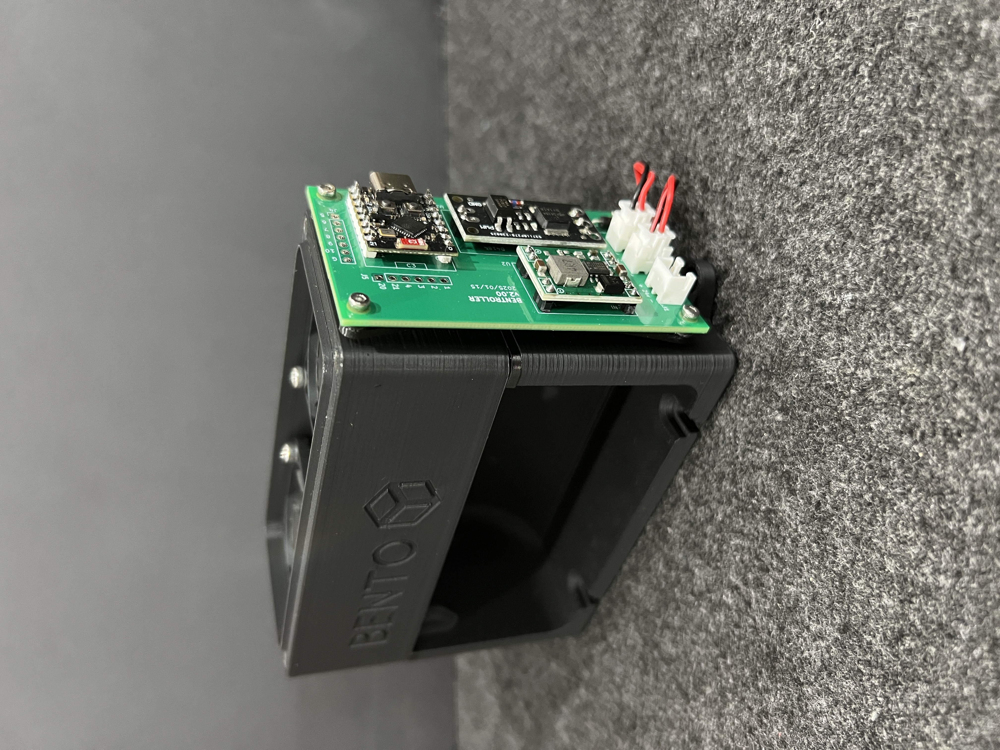

# Bentroller V2

PCB design for controlling the populer BentoBox air filter. The PCB uses an ESP32 to simple control of the Bentobox in Home Assistant. This project is aimed primary for when the BentoBox is used in a Bambu Labs printer due to the closed firmware.

The design goals were as follows:
- Use 24v supply from the printers PSU.
- Control the fans remoteley from Home Assistant.

## Bill of Materials (BOM)

| Qty | Item                                          | Notes                        |
| --- | --------------------------------------------- | ----------------------------------------------------------------------------------------- |
| 1   | ESP32-C3 Super Mini                           |                                                                                           |
| 1   | MP1584 voltage converter module (buck converter) | Preset to 3v is preferred but adjustable is fine.                                      |
| 1   | D4184 MOSFET Control Module                   |                                                                                           |
| 1   | 1N5819 Diode                                  |                                                                                           |
| 3   | 2-pin JST-HX through hole connectors          |                                                                                           |
| 4   | M2x6 SHCS                                     | These are for mounting the PCB to the BentoBox.                                           |

## Printed Parts
There are parts to print in the stl folder to mount the board to the side of the BentoBox. It is a bit hacky but it works. Print 1 of each mouth part and 4 spacers.